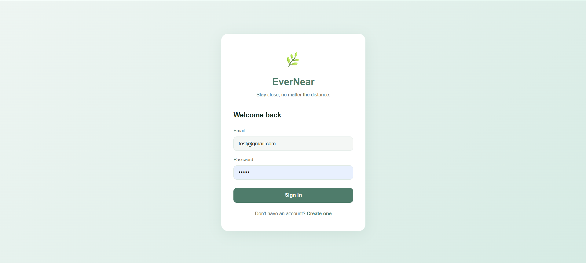
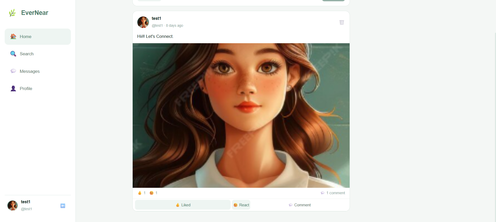
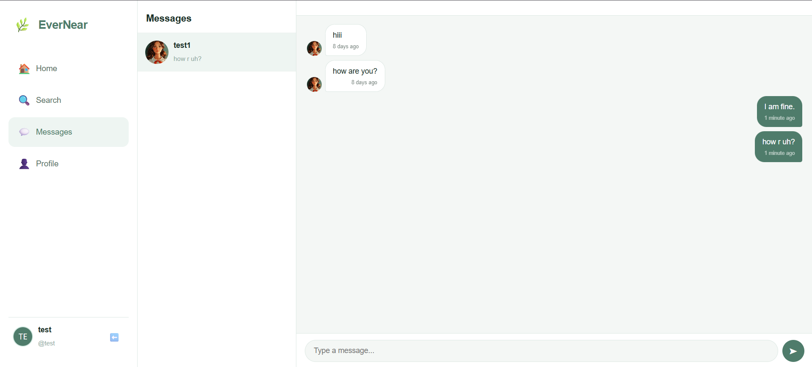

# 🌿 EverNear

**EverNear** is a social networking platform designed to help families and close friends stay connected no matter the distance. It provides a secure and user-friendly environment for sharing memories, chatting in real time, and interacting through posts.

---

## 📖 Overview

EverNear allows users to:

- 👤 Create an account and securely log in
- 📝 Share posts and memories
- ❤️ Like and comment on posts
- 👥 Connect with friends
- 💬 Chat in real time using Socket.IO
- 🟢 View online/offline status
- 🔍 Search for other users
- ✏️ Manage personal profiles

---

# ✨ Features

### Authentication
- User Registration
- Secure Login
- JWT Authentication
- Password Hashing using bcrypt

### User Profile
- Edit Profile
- Upload Profile Picture
- Update Bio
- View Friend List

### Posts
- Create Posts
- Upload Images
- Like Posts
- Comment on Posts
- Different Post Types

### Real-Time Messaging
- One-to-One Chat
- Online User Status
- Typing Indicator
- Instant Message Delivery

### Friend System
- Send Friend Requests
- Accept Friend Requests
- View Friends

---

# 🏗️ Tech Stack

## Frontend
- React.js
- Vite
- React Router DOM
- Axios
- Socket.IO Client
- React Hot Toast

## Backend
- Node.js
- Express.js
- MongoDB Atlas
- Mongoose
- JWT
- bcryptjs
- Socket.IO
- Multer

---

# 📂 Project Structure

```
EverNear/
│
├── frontend/
│   ├── src/
│   │   ├── components/
│   │   ├── context/
│   │   ├── pages/
│   │   ├── utils/
│   │   └── App.jsx
│   └── package.json
│
├── backend/
│   ├── src/
│   │   ├── config/
│   │   ├── controllers/
│   │   ├── middleware/
│   │   ├── models/
│   │   ├── routes/
│   │   ├── socket.js
│   │   └── server.js
│   └── package.json
│
└── README.md
```

---

# 🗄️ Database

MongoDB Atlas is used as the cloud database.

Collections include:

- Users
- Posts
- Messages

---

# ⚙️ Installation

## Clone Repository

```bash
git clone https://github.com/yourusername/EverNear.git
```

---

## Backend Setup

```bash
cd backend
npm install
```

Create a `.env` file

```env
PORT=5000

MONGO_URI=your_mongodb_connection_string

JWT_SECRET=your_secret_key

CLIENT_URL=http://localhost:5173
```

Run Backend

```bash
npm run dev
```

---

## Frontend Setup

```bash
cd frontend
npm install
```

Create `.env`

```env
VITE_API_URL=http://localhost:5000/api

VITE_SOCKET_URL=http://localhost:5000
```

Run Frontend

```bash
npm run dev
```

---

# 🔗 API Endpoints

## Authentication

| Method | Endpoint |
|---------|----------|
| POST | /api/auth/register |
| POST | /api/auth/login |
| GET | /api/auth/me |
| POST | /api/auth/logout |

---

## Users

| Method | Endpoint |
|---------|----------|
| GET | /api/users |
| GET | /api/users/:id |
| PUT | /api/users/profile |

---

## Posts

| Method | Endpoint |
|---------|----------|
| GET | /api/posts |
| POST | /api/posts |
| PUT | /api/posts/:id |
| DELETE | /api/posts/:id |

---

## Messages

| Method | Endpoint |
|---------|----------|
| GET | /api/messages/:userId |
| POST | /api/messages |

---

# 🔄 Real-Time Communication

Socket.IO is used for:

- User Online Status
- Private Messaging
- Typing Indicator
- New Post Notifications

---

# 🖼️ Screenshots

## Login Page



```text
screenshots/login.png
```

---

## Register Page


```text
screenshots/register.png
```

---

## Feed



```text
screenshots/feed.png
```

---

## Chat



```text
screenshots/chat.png
```

---

# 👩‍💻 Author

**Nyx**

Institute Of Engineering And Technology

Lucknow, India

---

# 📜 License

This project is developed for educational and hackathon purposes.
